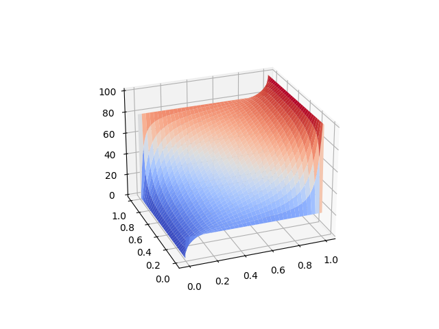
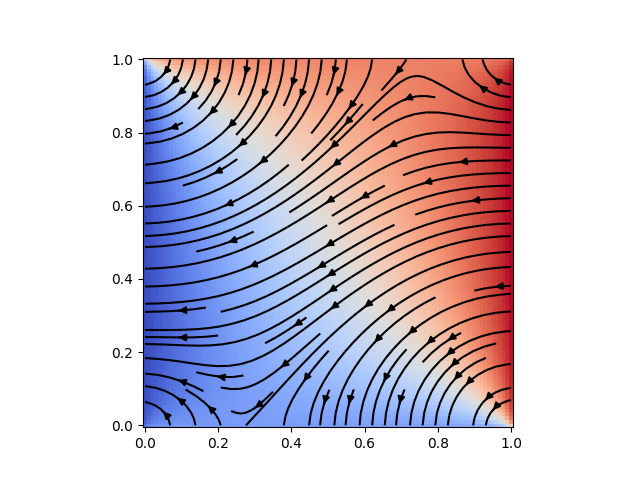
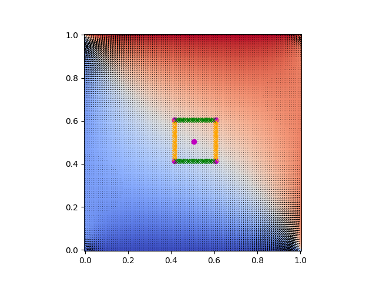
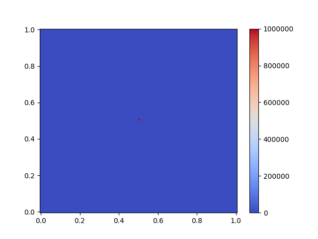
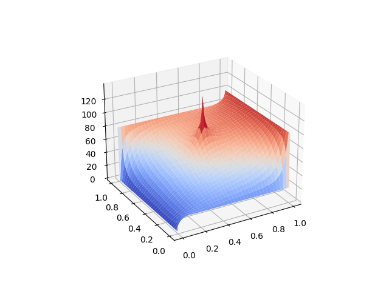
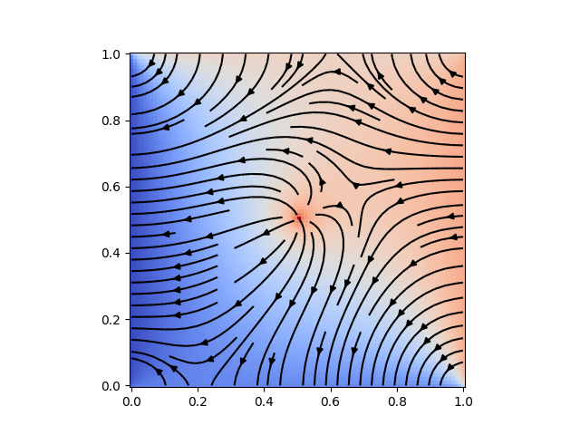
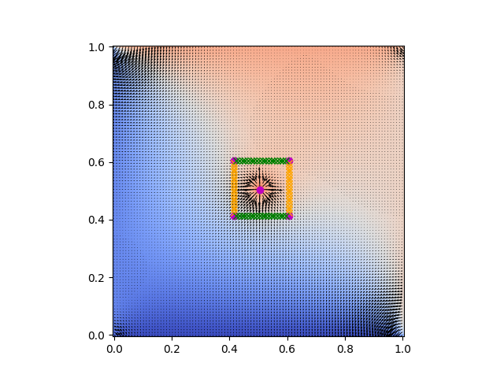
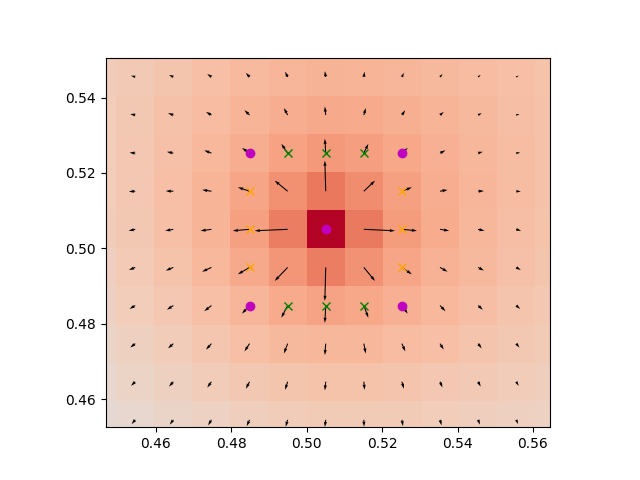

# PHYS3061 Lab 6
## Poisson Equation

Solving Poisson equation using Jacobi iteration scheme and verify result using Gauss law.

## Requirements
- python 3.7
- numpy
- matplotlib (For visualization)
- **h5py (For output file)**

## Usage
To run the simulation, do:

    python poisson.py

Adjust the parameters to simulate different configurations. The result will be output as `poisson-{timestamp}.hdf5`.

To visualize the result, do the following:

    python visualize.py [-h] --path PATH (--field | --pot | --rho)

The flags `--field`, `--pot` and `--rho` are mutual exclusive flags used to visualize the electric field, potential, and charge density respectively.

To verify Gauss law, do:

    python gauss-law.py --path PATH

This will plot a graph visualizing the gaussian surface and also calculate the flux passing through the surface.

## Simulation Result

### Charge free simulation
We solve the poisson equation without source term (i.e. laplace equation) using 100x100 grids in a 1x1 region and it gives the following potential distribution and electric field:

Calculating the flux at the center using a 20x20 square surface (See figure below) gives `-0.001`, which is close to zero:

### Charge in middle
Then, a point charge of `+1 C/ε0` is placed at the center of the grid.

The charge density is 1e6 because a point charge should be represented by a delta function in the charge density, so `rho*h^2 = Q`, where `rho` is the charge density, `h` is grid size, and `Q` is the amount of charge (here +1 C/ε0). Using the same resolution of the free charge case, we compute the following potential and electric field:

As expected, the point charge create a peak at the center of the plot and the electric field is pointing outward from the point charge.

Again, we can verify gauss law using a 20x20 gaussian surface:

The result is `flux=0.998833`, which is close to the +1 unit charge point charge expected. Using a smaller Gaussian surface (5x5) yields an even better result of `flux=0.999946`

### List of output files
| File name                   | Corresponds to                              |
|-----------------------------|---------------------------------------------|
| poisson-09-27-39-29-03.hdf5 | Point charge (-ve) at middle                |
| poisson-09-34-12-29-03.hdf5 | Point charge (+ve) at middle                |
| poisson-09-42-54-29-03.hdf5 | Point charge (+ve) at middle with BCs all 0 |
| poisson-09-50-54-29-03.hdf5 | No charge (Laplace equation)                |